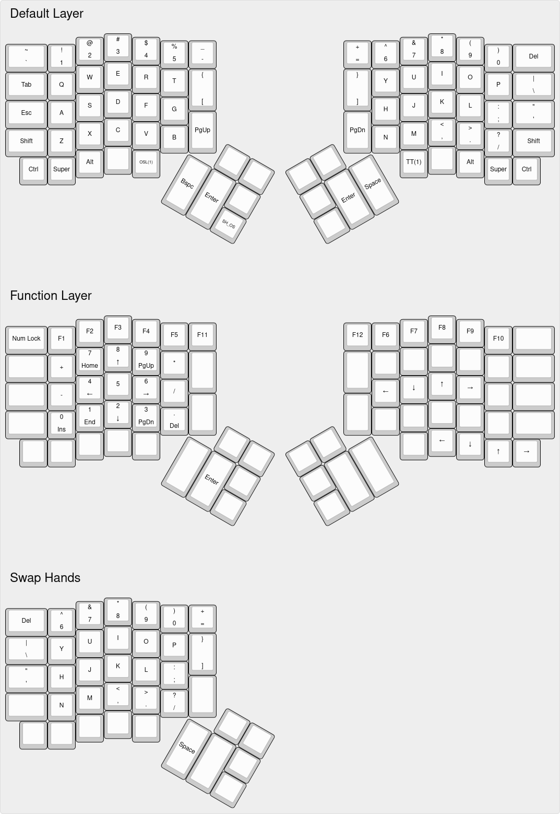

# IFo Hancroft's HotDox76v2 Layout

- Layer 0: Default Layer
- Layer 1: Function Layer
- Layer 2: Empty Layer
- Layer 3: Empty Layer

This keymap also configures the following features, regardless of the defaults:

- Sets:
    - Tapping Toggle to 3
    - USB Polling Rate to 1000 Hz
- Enables:
    - Command
    - NKRO (forced on)
    - Swap Hands
    - Via
- Disables:
    - Console
    - Extra Key
    - Mouse Key
    - RGB Matrix
